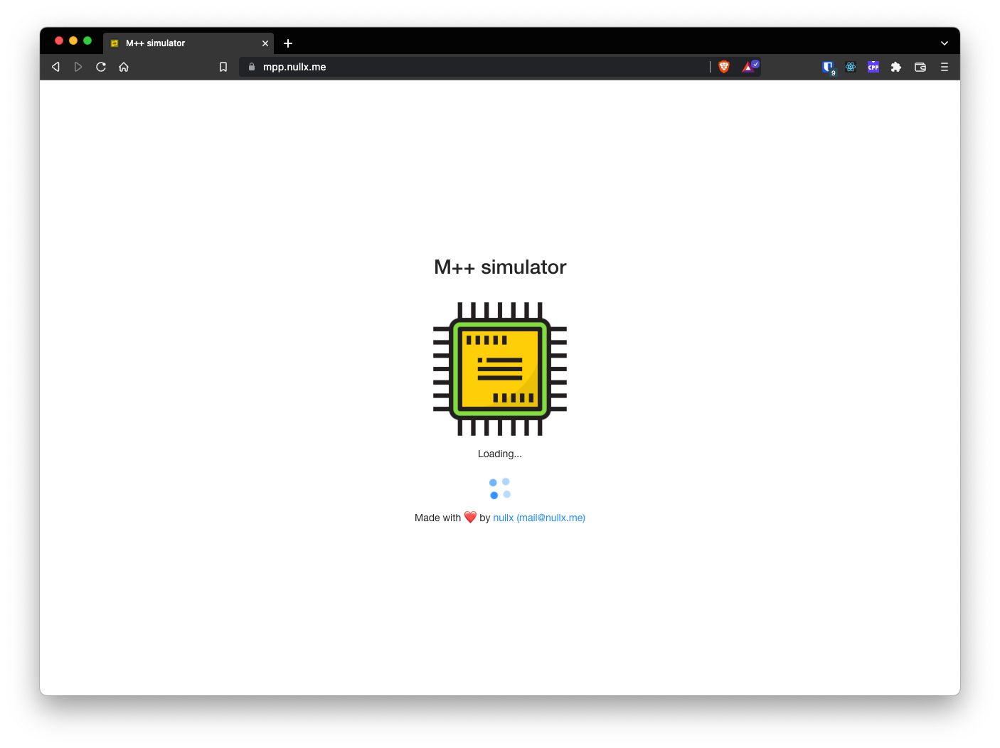
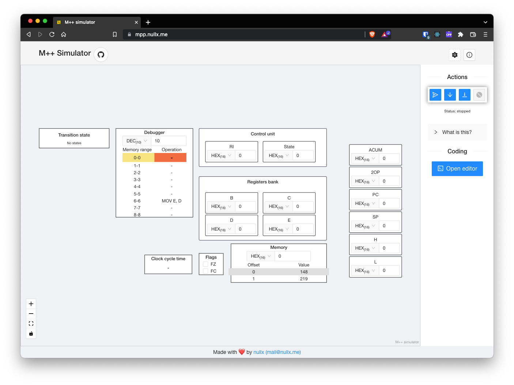
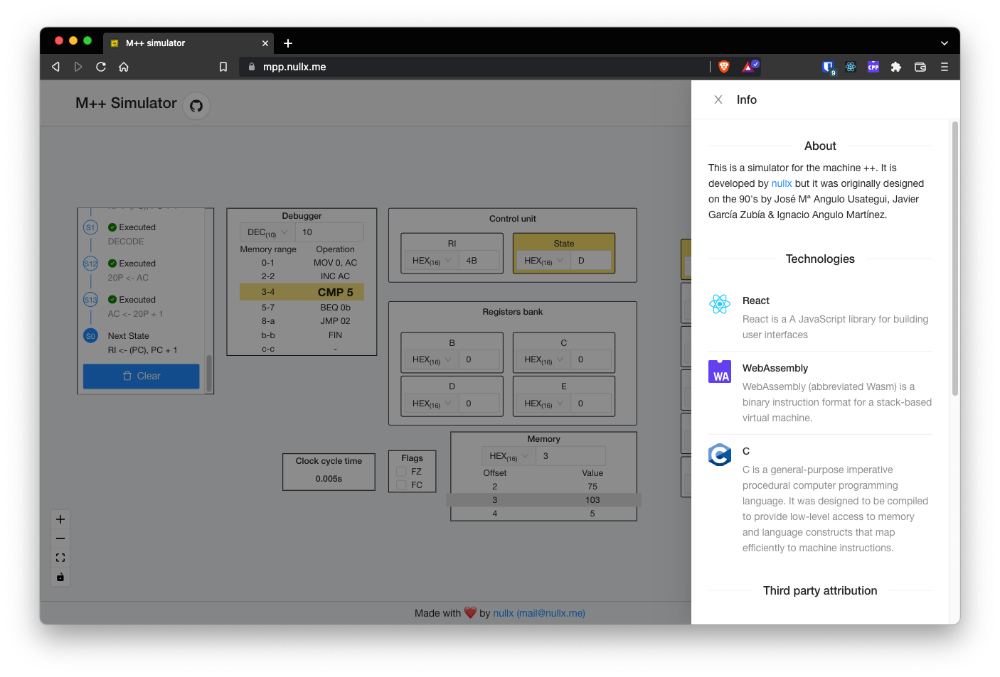
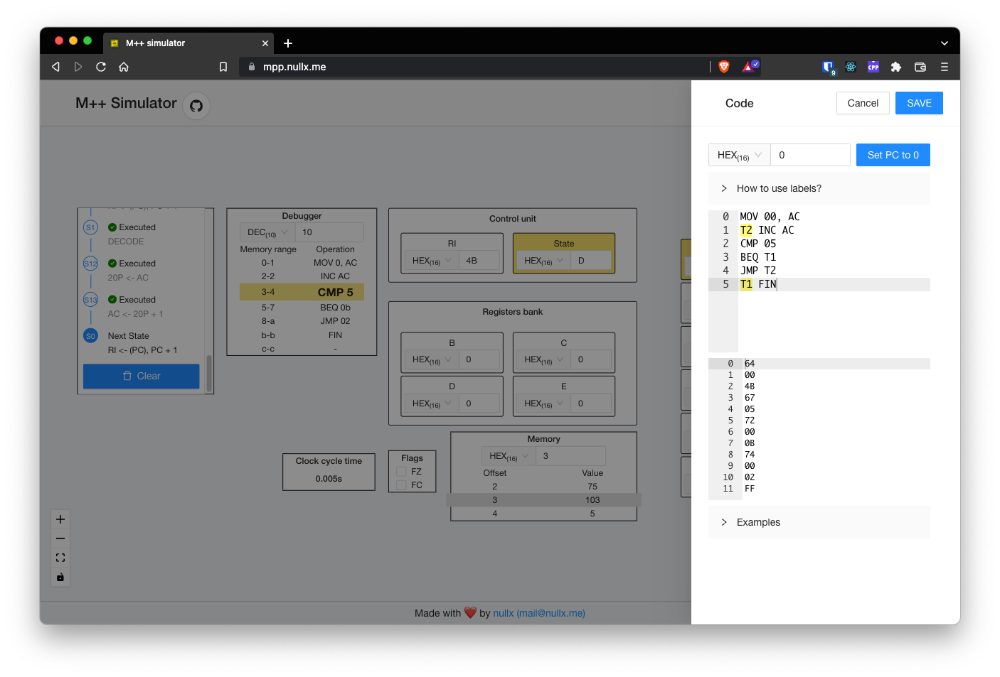
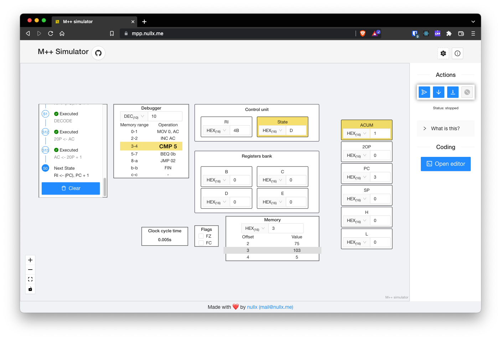

<h1 align="center">Welcome to mpp 👋</h1>

  
  

> Mpp is a simulator for the machine ++
### Read the [docs](https://mpp-docs.nullx.me)
### ✨ [Demo](https://mpp.nullx.me)

This project is the base and reference for the following ones:
- [M++ on real hardware](https://github.com/nullxx/ms)
- [MS Simulator](https://github.com/nullxx/ms)

## Screenshots

## Author

👤 **nullx**

* Website: nullx.me
* Twitter: [@nullxme](https://twitter.com/nullxme)
* Github: [@nullxx](https://github.com/nullxx)
* LinkedIn: [Jon Lara Trigo](https://linkedin.com/in/jon-lara-trigo-965ab898/)

## Show your support

Give a ⭐️ if this project helped you!

## 📝 License

Copyright © 2022 [nullx](https://github.com/nullxx). 
This project is [MIT](https://opensource.org/licenses/MIT) licensed.

***
